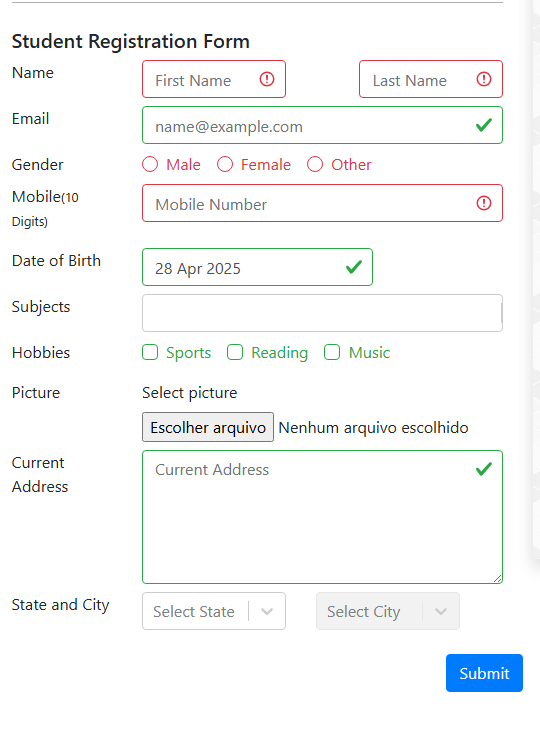

Bug Title: 
* Required Fields Allow Form Submission Without Validation

Description:
* When submitting the form without filling the required fields (Name, Mobile Number, Gender), the system allows the submission without showing any validation error or blocking the action.

Expected Results:
* The form should not submit and the system should highlight missing fields and block submission until all required fields are completed.

Steps to reproduce:
* Go to https://demoqa.com/automation-practice-form
* Verify that the fields Name, Gender and Mobile aren't filled in
* Click on the Submit Button

Visual attachment:

Severity:
* High — Basic validation is critical for form integrity and user data quality.
